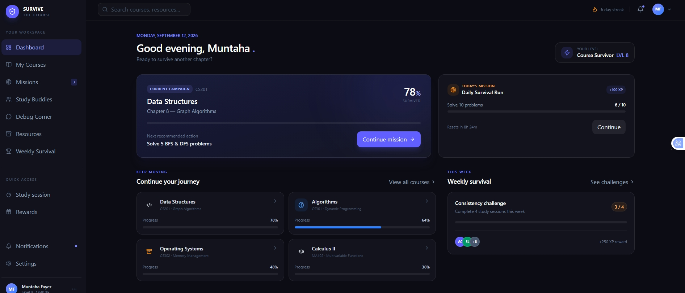
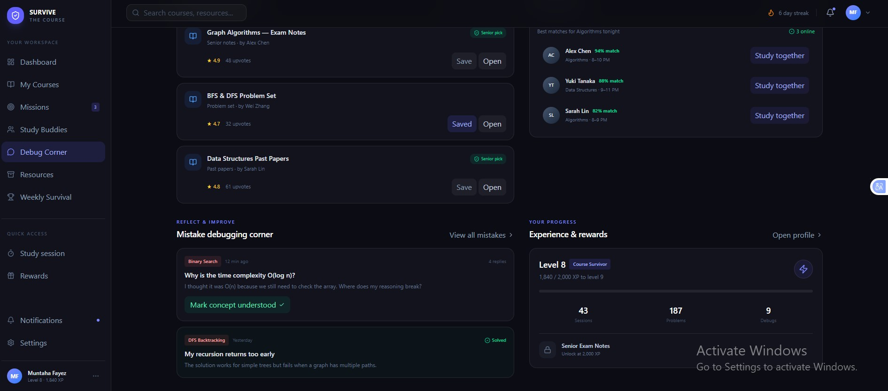

# Survive the Course

### Survive the course. Together.

A gamified academic collaboration platform designed for HITSZ students to study together, find study buddies, share resources, solve difficult problems, and make academic progress feel more structured and motivating.

<p align="center">
  
  
</p>
---

## 🎯 The Problem

University students often know **what** they need to study, but struggle with:

- Finding the right person to study with
- Staying consistent with their study goals
- Knowing what to work on next
- Getting help when they are stuck
- Finding useful course resources in one place
- Learning from mistakes instead of repeating them
- Staying motivated throughout a difficult semester

Existing academic platforms often focus on either **content** or **communication**.

We wanted to explore a different approach:

> What if studying a course felt like progressing through a survival campaign—with teammates, missions, progress, and meaningful rewards?

---

# 💡 Our Solution

**Survive the Course** turns academic progress into a collaborative survival journey.

Instead of treating a course as a collection of lectures and assignments, the platform represents it as a **campaign**.

Students can:

- Track their progress through a course
- Complete study missions
- Earn XP for meaningful academic actions
- Find compatible study buddies
- Join focused study sessions
- Share and discover useful resources
- Post mistakes and get help debugging them
- Complete weekly survival challenges
- Unlock useful academic rewards

The goal is not to make studying into a game for the sake of gaming.

The goal is to use **gamification as a motivation and collaboration layer around real academic work**.

---

# 🔄 Core Loop

```text
Study
  ↓
Solve
  ↓
Make mistakes
  ↓
Debug / Learn
  ↓
Help others
  ↓
Earn XP
  ↓
Unlock useful resources
  ↓
Progress through the course
  ↓
Survive the course
